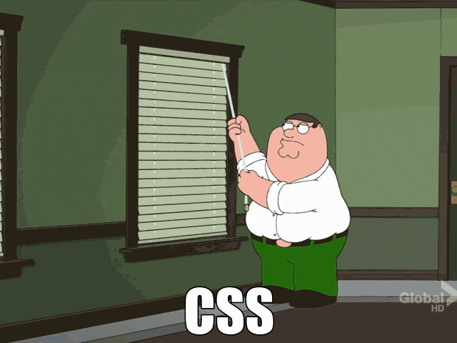
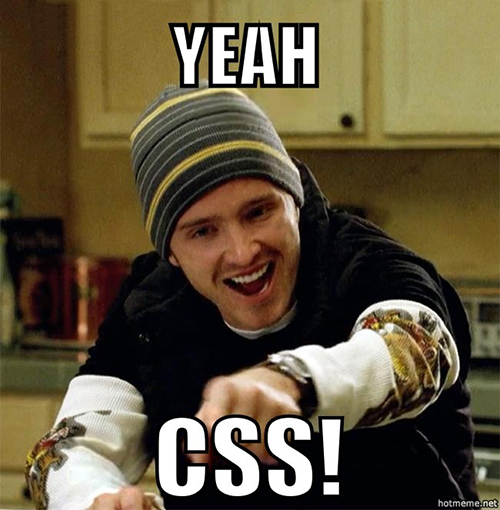

Learning CSS is not an easy task. I found this exaclty the hard way. The first time I saw CSS code was in High School, when I took a course in which we learned the HTML, CSS and JS basics. So far so good, it was easy, I understood what I was doing and everything worked as I expected. Didn't use CSS anymore, until 2012, when I started a blog and decided to develop my first layout. It was just too much for me back then, without knowing any CSS, to develop a layout completely out of the blue. So I decided to take something as a boilerplate and just adjust. And that was when the Peter Griffin gif made a lot of sense! I changed one comma and all of a sudden everything was out of place. I tried to change some text's color and nothing happened, I tried every `position` possibility until I got what I wanted, and when I resized the window, everything was a mess again!

<figure class="pic-post-center">
  
  <figcaption>Thousands of dev's feeling by Peter Griffin</figcaption>
</figure>

So I decided that when coding CSS I would only change stuff that I knew what would happen. If a `div` had a `position: fixed` I would only changed if I knew that this line was making the `div` stay fixed on that place of the screen. Now that I had to search what every attribute does before being able to change anything, I had to read amazing tutorials and develop a lot faster. If you know what you are doing while adding style to a page (even if it is just altering something that is done), you finish a lot faster and without losing any hair.

I decided to make this post to gather tutorials, tools and useful links for those who want to understand CSS and stop stressing out once for all! This post will be updated as I see new nice links, and if you have a suggestion, send it to me! :)

 

#### Fun links
I think that we learn a lot more when we don't keep ourselves reading texts and more texts, right? There are some fun tutorials (and even games) out there.
I've gathered some of them:

 
__Learning Layout with CSS (portuguese)[(link)](http://pt-br.learnlayout.com/)__

This tutorial explains the basics of CSS when developing a layout. With illustrative examples, you navigate through steps that explain how properties like `display`, `margin`, `box-sizing`, `position`, `float`, `flex` work.

 
__Web design in 4 minutes [(link)](http://jgthms.com/web-design-in-4-minutes/)__

I found this one fantastic! Jeremy Thomas talks to you and intuitively you will think about what needs to be changed, and when clicking on the links, he explains how to do it. At the end we have a really nice and well styled static page  :)

 
__CSS Dinner - Game [(link)](https://flukeout.github.io)__

This is a really nice game! With a cute design, it challenges you to select stuff on the dinning table, and in the end you will know all the selectors in CSS. I loved this, seriously <3

 

#### Useful links - W3schools
The W3schools have a lot of material! It is definetly worth it to check it out and navigate through the links. I selected some to highlight:

 
__W3schools Reference [(link)](http://www.w3schools.com/cssref/default.asp)__

When you need to know what that property does, I recommend this link. It has a reference list of all properties, divided in groups.

 
__Responsive CSS tutorial [(link)](http://www.w3schools.com/css/css_rwd_intro.asp)__

Knowing CSS is not enougth! Knowing how to use CSS in your favor to make your layout responsive is essencial for a good development. The W3schools has this awesome tutorial about responsive CSS.

 
__CSS exercises [(link)](http://www.w3schools.com/css/exercise.asp?filename=exercise_selectors1)__

Is there a better way to learn than practicing? The W3schools, besides all reference material and tutorials, has some really cool exercises to practice your CSS!

 

 

That's all folks! I hope you have the same reaction that I had after checking the game out. Illustrating:

<figure class="pic-post-center">
  
  <figcaption>Me after the game :D</figcaption>
</figure>

